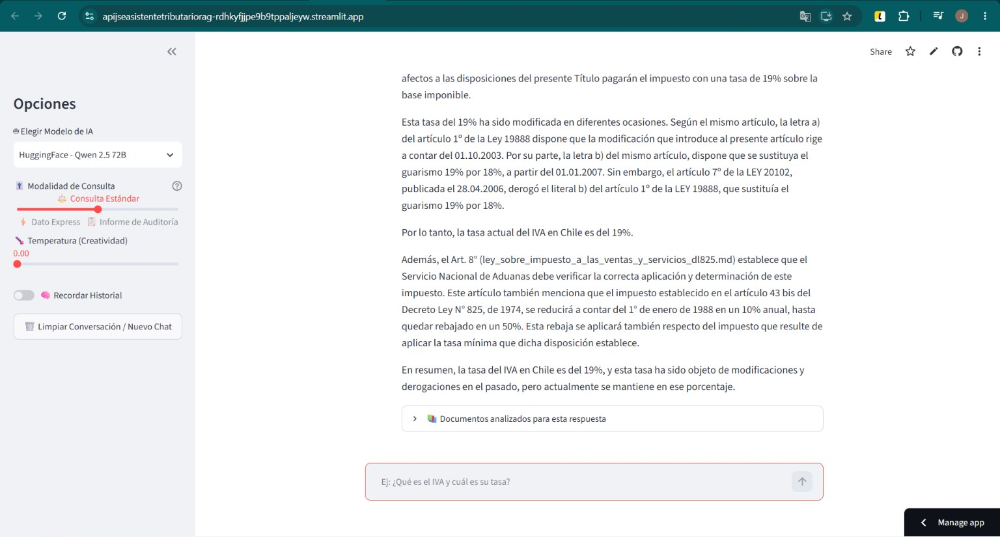

# 🏛️ API JSE - Asistente Tributario RAG (Chile)

> **Asistente de Inteligencia Artificial especializado en normativa tributaria chilena, diseñado con arquitectura RAG avanzada para Contadores Auditores y especialistas en tributación.**

[](https://github.com/JoseRicardoSE/API_JSE_Asistente_Tributario_RAG)
[](https://opensource.org/licenses/MIT)

---

## 🌐 Aplicación en Vivo

¡Prueba la aplicación directamente desde tu navegador sin instalar nada!  
👉 **[Acceder al Asistente Tributario RAG](https://apijseasistentetributariorag-rdhkyfjjpe9b9tppaljeyw.streamlit.app/)**  
*(Nota: Esta demo online se encuentra desplegada utilizando los proveedores LLM de Groq y HuggingFace).*

---

## 🎯 Sobre el Proyecto

Este sistema no es un chatbot tradicional; es un motor de consulta legal construido sobre la arquitectura **RAG (Retrieval-Augmented Generation)**. Garantiza precisión técnica absoluta evitando alucinaciones, ya que obliga a los modelos LLM a justificar cada respuesta citando explícitamente los cuerpos legales, su estructura jerárquica (Libro, Título, Párrafo) y sus respectivos artículos.

El proyecto ya incluye pre-cargada la **"Santísima Trinidad" del Derecho Tributario Chileno**:
* 📘 **Ley sobre Impuesto a la Renta** (DL 824)
* 📙 **Ley sobre Impuesto a las Ventas y Servicios - IVA** (DL 825)
* 📕 **Código Tributario** (DL 830)

### 📸 Demostración Visual

<div align="center">
  
</div>

<br>

**Ejemplo de Funcionamiento (Chat):**
<div align="center">
  
</div>

<br>

**Ejemplo de Funcionamiento (RAG):**
<div align="center">
  
</div>

---

## ✨ Características Técnicas Principales (Data Engineering & AI)

* 📖 **Pipeline de Datos e Ingesta (`ingest.py`):** 
    - **Limpieza de Ruido Institucional (Regex):** Parser avanzado de expresiones regulares que limpia las imperfecciones de los documentos de la Biblioteca del Congreso Nacional (BCN), eliminando notas marginales, saltos de página y tablas HTML rotas.
    - **Estructuración Jerárquica Estricta:** Reconstrucción automática del árbol legal mediante la detección de Libros, Títulos, Párrafos, Artículos y Letras para asignarles el formato Markdown correspondiente.
    - **Inyección de Metadatos (Context Injection):** Soluciona la "amnesia de contexto" insertando la jerarquía legal exacta dentro de cada fragmento antes de vectorizarlo. Así, el LLM no pierde el contexto de la ley al analizar artículos individuales.
    - **Doble Estrategia de Chunking:** Combina un `MarkdownHeaderTextSplitter` para respetar la integridad semántica de cada Artículo, respaldado por un `RecursiveCharacterTextSplitter` de seguridad para artículos excesivamente largos.

* 🧠 **Orquestación y Motor RAG (`app.py` / `streamlit_app.py`):**
    - **Retriever Dinámico (Top-K):** El motor ajusta matemáticamente la cantidad de documentos recuperados (chunks) basándose en la Modalidad de Consulta elegida por el usuario (`k=3` para respuestas express, `k=12` para informes).
    - **Expansión de Consulta (Query Expansion):** Intercepción de acrónimos en tiempo real (ej. "IVA" -> "Impuesto al Valor Agregado DL 825") para forzar una recuperación exacta en leyes que no utilizan siglas.
    - **Caché Inteligente Hash MD5:** Sistema de caché avanzado a nivel de backend que guarda un registro criptográfico combinando el proveedor LLM, el modelo, la temperatura, el modo y todo el historial de la conversación. Logra latencia cero y cero consumo de tokens en consultas repetidas.
    - **Soporte Multi-Modelo (Factory Pattern):** Inferencia agnóstica que permite cambiar en caliente entre Groq, Google, Cohere, HuggingFace y Ollama (modelos 100% locales).
    - **Prompt Engineering Dinámico y Anti-Alucinaciones:** Inyecta diferentes reglas de formato en tiempo de ejecución (System Prompts) según la modalidad, exigiendo siempre al LLM que justifique su respuesta usando la metadata recuperada.
* 🧠 **Embeddings Locales:** Utiliza `FastEmbed` (`paraphrase-multilingual-MiniLM-L12-v2`) ejecutándose localmente, lo que elimina el costo por token al momento de vectorizar los documentos hacia **Qdrant Cloud**.
* 🎨 **Interfaz de Usuario Avanzada (Streamlit):**
  * **Modalidades de Consulta:** Permite elegir entre 'Dato Express', 'Consulta Estándar' e 'Informe de Auditoría', ajustando dinámicamente el comportamiento del LLM.
  * **Control de Creatividad:** Ajuste de temperatura para transicionar entre respuestas estrictamente precisas (0.0) y más abiertas (1.0).
  * **Memoria de Conversación:** Opción para activar o desactivar el historial del chat, optimizando el consumo de tokens cuando no se requiere el contexto previo.
  * **Transparencia de Fuentes:** Despliega en la interfaz los documentos y artículos exactos que el modelo consultó para formular su respuesta.

---

## 🛠️ Stack Tecnológico

| Capa | Tecnologías |
| :--- | :--- |
| **Backend & API** | FastAPI, Uvicorn, Python 3 |
| **Orquestación AI** | LangChain, LangChain-Qdrant |
| **Frontend** | Streamlit |
| **Base de Datos Vectorial** | Qdrant Cloud |
| **Embeddings** | FastEmbed (Local) |
| **Proveedores LLM** | Groq, Google GenAI, Cohere, HuggingFace, Ollama |

---

## 🚀 Guía de Instalación Local

Sigue estos pasos para ejecutar el proyecto de forma local en tu computadora.

### 1. Clonar el repositorio
```bash
git clone https://github.com/JoseRicardoSE/API_JSE_Asistente_Tributario_RAG.git
cd API_JSE_Asistente_Tributario_RAG
```

### 2. Configurar entorno virtual (Recomendado)
```bash
python -m venv .venv
# En Windows:
.venv\Scripts\activate
# En Mac/Linux:
source .venv/bin/activate
```

### 3. Instalar dependencias
```bash
pip install -r requirements.txt
```

### 4. Variables de Entorno
Crea un archivo `.env` en la raíz del proyecto.
> ⚠️ **Importante:** Por seguridad, este archivo está en `.gitignore`. Nunca lo subas a tu repositorio.

```env
# Vector Database (Requerido)
QDRANT_URL=tu_url_de_qdrant_cloud
QDRANT_API_KEY=tu_api_key_de_qdrant

# LLM Providers (Deja en blanco los que no uses)
GROQ_API_KEY=tu_api_key_de_groq
GEMINI_API_KEY=tu_api_key_de_gemini
COHERE_API_KEY=tu_api_key_de_cohere
HUGGINGFACE_API_KEY=tu_api_key_de_huggingface

# Nota sobre Ollama: 
# Si usas Ollama, asegúrate de tener el motor corriendo localmente en el puerto por defecto (localhost:11434).
```

### 5. Ingesta de Documentos (Opcional)
Si deseas reconstruir la base de datos vectorial o agregar nuevos documentos Markdown a la carpeta `documentos_legales_md`:
```bash
python ingest.py
```
*Verás en consola cómo el script limpia la metadata de la BCN y genera los chunks estructurados.*

### 6. Ejecución de la Aplicación (Arquitectura Completa)
Se requieren dos terminales para levantar el backend y el frontend.

**Terminal 1 (Backend - FastAPI):**
```bash
uvicorn app:app --reload
```
*La API quedará disponible en: `http://localhost:8000`*

**Terminal 2 (Frontend - Streamlit):**
```bash
streamlit run ui.py
```
*El navegador se abrirá automáticamente con la interfaz del Chat RAG.*

*(Si solo quieres ejecutar la versión unificada localmente, puedes correr directamente `streamlit run streamlit_app.py`)*

---

## ☁️ Despliegue en Streamlit Cloud (Versión Unificada)

Si deseas subir esta aplicación a **Streamlit Community Cloud** (donde no es posible ejecutar un servidor backend de FastAPI), debes usar el archivo especial llamado `streamlit_app.py`.

Este archivo **combina** la lógica de Inteligencia Artificial (LangChain) y la Interfaz Gráfica (Streamlit) en un único script.

**Pasos para desplegar en la nube:**
1. Al crear la app en [share.streamlit.io](https://share.streamlit.io/), en la opción **"Main file path"**, escribe `streamlit_app.py`.
2. En la configuración de la app en la nube (Settings > Secrets), asegúrate de pegar tus variables de entorno en formato TOML (como `QDRANT_URL`, `QDRANT_API_KEY` y tus API Keys de Groq o Gemini).

---

## 💡 Ejemplos de Preguntas y Respuestas

Aquí tienes algunos ejemplos de consultas que puedes hacerle al asistente para probar su eficacia:

**Ejemplo 1 (Cálculos y Tasas):**
> **Usuario:** "¿Cuál es la tasa actual del IVA y en qué artículo se fundamenta?"
> **Asistente RAG:** "De acuerdo al **ARTÍCULO 14 (ley_sobre_impuesto_a_las_ventas_y_servicios_dl825.md)**, la tasa del Impuesto al Valor Agregado es del 19%."

**Ejemplo 2 (Casos de Exención):**
> **Usuario:** "¿Están exentas de IVA las exportaciones?"
> **Asistente RAG:** "Sí. Según el **ARTÍCULO 12, Letra D (ley_sobre_impuesto_a_las_ventas_y_servicios_dl825.md)**, estarán exentas del impuesto las especies exportadas en su venta al exterior."

**Ejemplo 3 (Análisis Técnico):**
> **Usuario:** "Explícame qué es el crédito fiscal en el IVA."
> **Asistente RAG:** "Basado en el **ARTÍCULO 23 (ley_sobre_impuesto_a_las_ventas_y_servicios_dl825.md)**, el crédito fiscal es el equivalente al impuesto recargado en las facturas por adquisiciones de bienes o utilización de servicios..."

---

## 📬 Contacto y Soporte

- **Autor**: José Salgado Escalona
- **LinkedIn**: [Perfil de LinkedIn](https://www.linkedin.com/in/josé-ricardo-salgado-escalona/)

---
⭐️ *Si este proyecto te resulta útil o interesante, no dudes en dejarle una estrella en GitHub.* ⭐️
